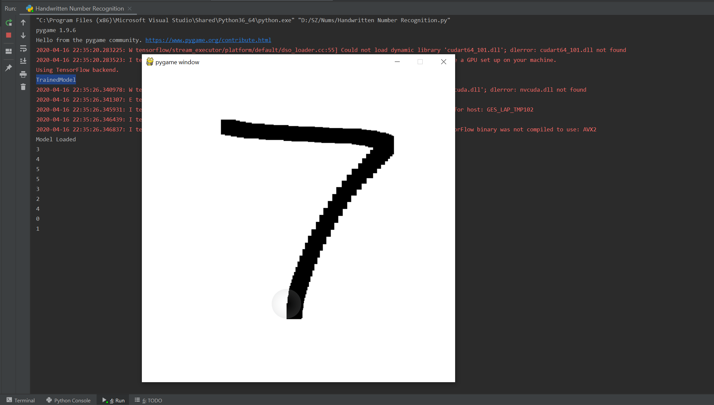

# Number-Recognition
A Python program which can recognise hand written digits. Draw a digit on the screen and the program will recognise the digit, once you stop drawing.

## Interface
Interface for writting digits was created using pygame. 

## Recogition
The digit recognition is done using CNN (convolutional neural network) with tensor flow and keras.
The MNIST handwritten digit dataset was used for training the model.
Pre-trained model is included with the project. Function for training a new model is also present in the code. Feel free to experiment with netowrk and create new models.
